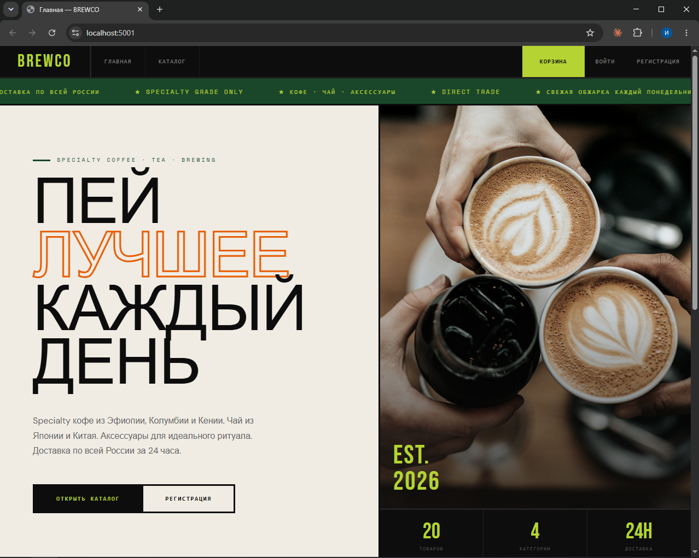
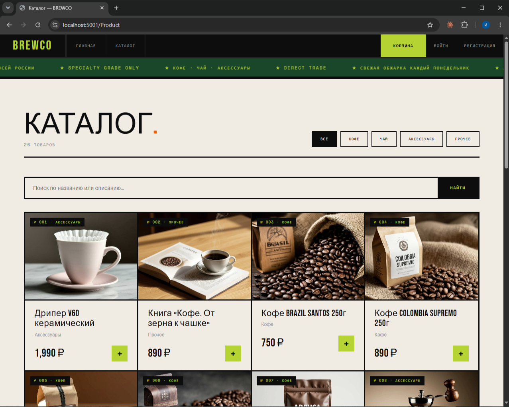
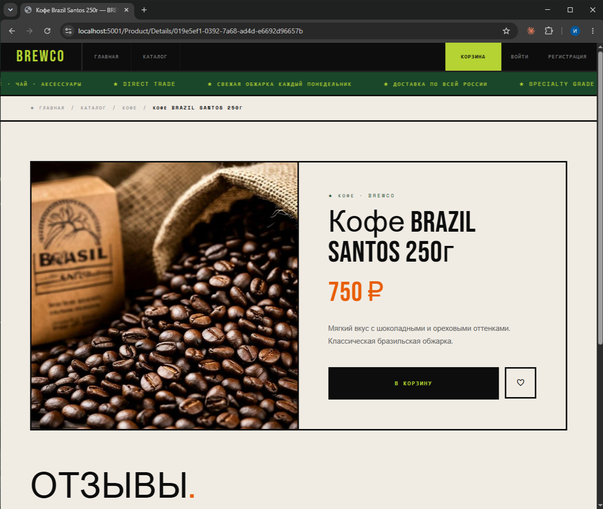
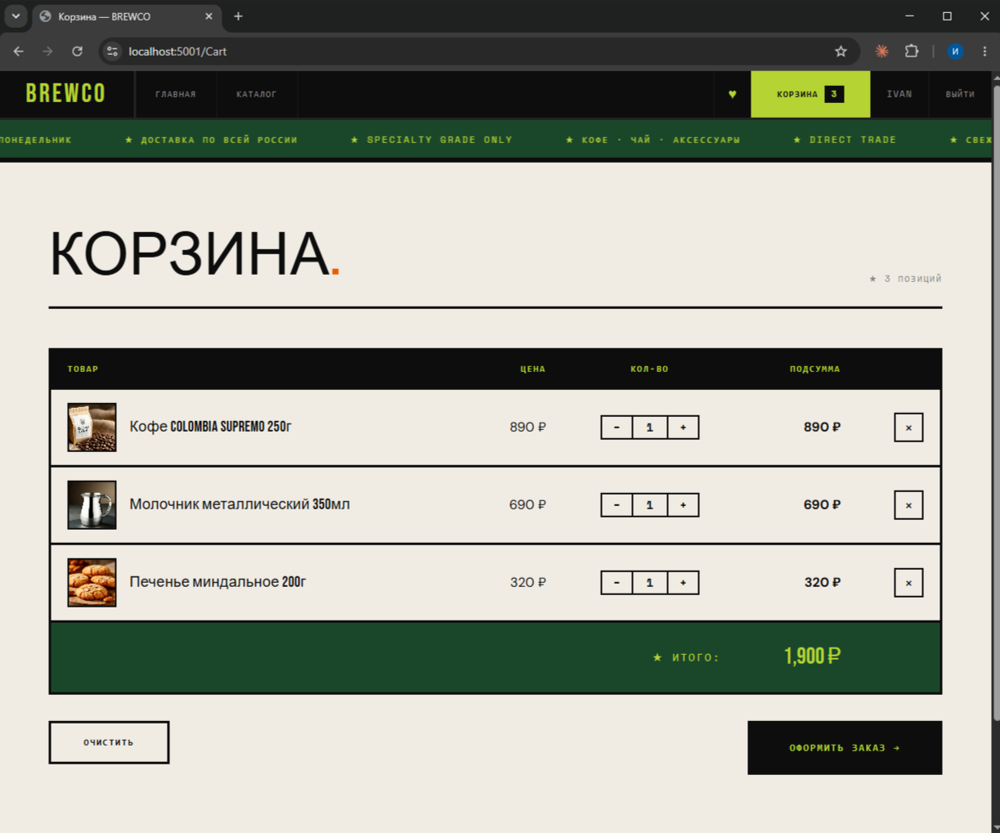
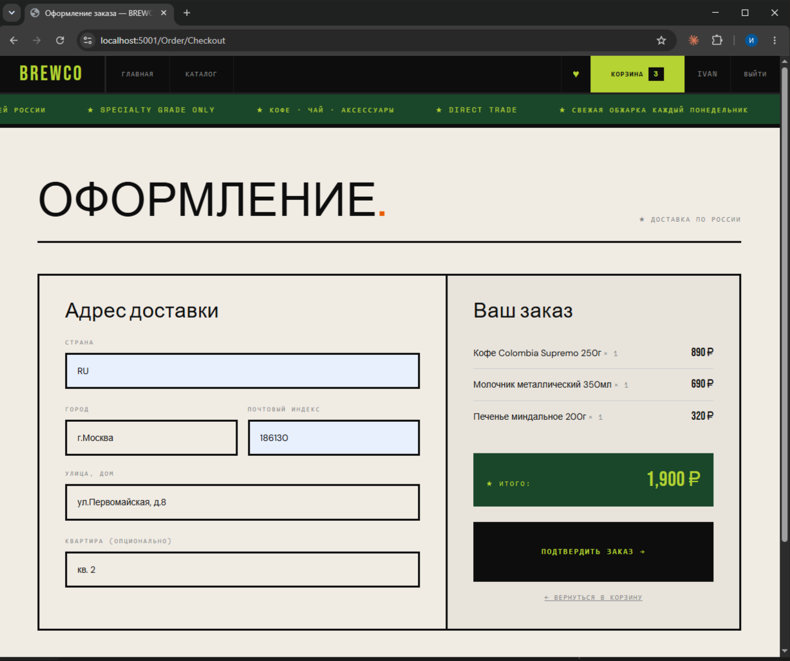
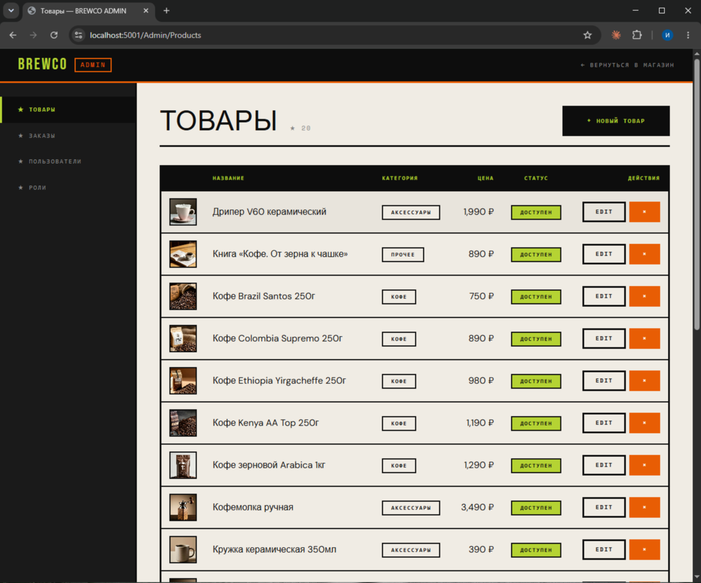

# BREWCO

> Онлайн-магазин кофе, чая и аксессуаров. ASP.NET Core 9 MVC. Brutalist Modern UI.

[](https://github.com/Vanchestery/OnlineShop/actions/workflows/ci.yml)


[](LICENSE)

Pet-проект уровня portfolio: полноценный e-commerce с покупательским и админским
интерфейсом, реальными бизнес-сценариями (анонимная корзина с merge на login,
frozen snapshot цен в заказе, фильтр-поиск каталога), 30 unit-тестами и
тематическим дизайном в стиле Brutalist Modern.

## Скриншоты

| Главная | Каталог | Карточка товара |
|---------|---------|-----------------|
|  |  |  |

| Корзина | Оформление | Админка |
|---------|------------|---------|
|  |  |  |

## Технологический стек

**Backend**
- ASP.NET Core 9 MVC + Razor Views
- Entity Framework Core 9 + Npgsql provider
- PostgreSQL 16 (через Docker Compose)
- ASP.NET Core Identity (аутентификация, роли, политики)
- AutoMapper 14 (Entity ↔ DTO mapping)
- Serilog (структурированное логирование в JSON-файл)

**Frontend**
- Razor Views с Tag Helpers
- Bootstrap 5 (используется только как utility-фреймворк для сетки/flex)
- Кастомный CSS в Brutalist Modern стиле (`wwwroot/css/brutal.css`)
- Google Fonts: Bebas Neue (заголовки), Space Mono (метки), DM Sans (текст)

**Тесты и DevOps**
- xUnit 2.9 + Moq 4.20 + FluentAssertions 6.12
- GitHub Actions CI (build + test на каждый push/PR)
- Docker Compose для PostgreSQL

## Архитектура

Чистая многослойная архитектура:

```
OnlineShop.sln
├── OnlineShop.Db/      — Entity-модели, ApplicationDbContext, миграции,
│                         IEntityTypeConfiguration, storage-интерфейсы и реализации,
│                         IdentityInitializer для сидинга
├── OnlineShop.Core/    — DTO, бизнес-сервисы, AutoMapper-профили, request-объекты
├── OnlineShop.Web/     — Контроллеры, ViewModels, Views, ViewComponents,
│                         Admin Area, Infrastructure (CartContext), Helpers
└── OnlineShop.Tests/   — Unit-тесты сервисов с моками
```

**Зависимости проектов** (стрелка = «ссылается на»):

```
Web   ──→ Core ──→ Db
Tests ──→ Core
```

То есть `Web` ссылается на `Core`, `Core` — на `Db`, `Tests` — на `Core`.
Это **классическая Layered (N-Tier) архитектура**: верхние слои зависят от нижних,
нижние не знают о верхних.

**Архитектурный guard:** `Web` напрямую НЕ ссылается на `Db` — попытка добавить
в контроллер `IProductsStorage` не скомпилируется, заставляя писать через
сервис-абстракцию `Core`.

> **Заметка про Clean Architecture.** Альтернатива Layered — Onion / Clean
> (`Web → Core ← Db`, где `Db` реализует интерфейсы из `Core` и сам зависит от него).
> Clean даёт более сильное decoupling: `Core` не знает про EF Core, можно сменить
> ORM без правок бизнес-логики. Цена — двойные модели (domain в `Core` + EF
> entities в `Db`) и явный mapping между ними.
>
> Для pet-проекта выбран Layered как более простой и идиоматичный для ASP.NET Core
> tutorial-ландшафта. На реальном продукте с командой 5+ или вероятностью смены
> инфраструктуры — Clean был бы оправдан.

## Возможности

### Покупатель

- Каталог товаров с поиском по названию/описанию (PostgreSQL `ILIKE`)
- Фильтр по категориям (Кофе / Чай / Аксессуары / Прочее)
- Страница товара с описанием, ценой, кнопкой «В корзину» и системой отзывов
- **Анонимная корзина** через cookie — добавляй товары не залогиниваясь
- **Merge корзины на login** — анонимная корзина сливается с пользовательской при
  входе или регистрации, дубли товаров суммируются по количеству
- Избранное (для авторизованных)
- Оформление заказа с адресом доставки
- Личный кабинет: профиль, история заказов, смена пароля
- Отзывы с рейтингом 1–5 ★ и средней оценкой

### Администратор

- **Управление товарами**: CRUD с загрузкой картинок в `wwwroot/images/products/`,
  валидация формата (jpg/png/webp) и размера (≤5 MB), автоматическая очистка
  файлов с диска при удалении товара
- **Управление заказами**: фильтр по статусу, детальный просмотр, смена статуса
- **Управление пользователями**: список, детали с ролями, админский сброс пароля
  через token (без знания старого), self-lock guard от удаления собственной
  Admin-роли
- **Управление ролями**: список, создание новых

### Технические особенности

- **Frozen snapshot в `OrderItem`** — `ProductName` и `Price` копируются на момент
  оформления заказа. Старые заказы остаются корректными даже после изменения
  цены или удаления товара в каталоге.
- **Partial unique index на `Cart.UserId`** — один пользователь имеет максимум
  одну корзину, анонимных корзин может быть сколько угодно
- **CHECK-constraint в БД** — `Quantity > 0` для CartItem/OrderItem, `Rating BETWEEN 1 AND 5` для Review
- **Owned-type Address** в Order — встроенные колонки `DeliveryAddress_*` вместо
  отдельной таблицы
- **Identity-flow безопасности**: AntiForgeryToken на всех POST, IsLocalUrl-проверка
  на `returnUrl` (open redirect защита), `RefreshSignInAsync` после смены пароля
  (обновление security stamp в куке), POST для logout (CSRF-safe), Url ownership
  check на Order/Details (защита от IDOR)

## Локальный запуск

### Требования

- [.NET 9 SDK](https://dotnet.microsoft.com/download)
- [Docker Desktop](https://www.docker.com/products/docker-desktop) (для PostgreSQL)
- `dotnet ef` tool: `dotnet tool install --global dotnet-ef --version 9.0.0`

### 1. Клонировать репозиторий

```bash
git clone https://github.com/Vanchestery/OnlineShop.git
cd OnlineShop
```

### 2. Поднять PostgreSQL

```bash
docker compose up -d
```

PG доступен на `localhost:5433` (порт нестандартный — чтобы не конфликтовать
с локальной установкой PG на 5432, если есть). Креды для dev в
`appsettings.Development.json`. Подробности — в комментариях
к `docker-compose.yml`.

### 3. Применить миграции

```bash
dotnet ef database update --project OnlineShop.Db --startup-project OnlineShop.Web
```

> Альтернативно: миграции автоматически применяются при первом старте
> через `ApplicationDbContext.Database.MigrateAsync()` в `Program.cs`.
> В production это **антипаттерн** (миграции должны накатываться отдельной
> CI-командой), но для pet-проекта удобно.

### 4. Запустить приложение

```bash
dotnet run --project OnlineShop.Web
```

Либо в Visual Studio: F5 (профиль `https`).

Сайт доступен на `https://localhost:5001`. При первом старте автоматически:
- создаются роли `Admin` и `User`
- создаётся admin-аккаунт
- сидится 20 демо-товаров с категориями

### Учётные данные по умолчанию

```
Email:    admin@onlineshop.local
Password: Admin#123
```

> ⚠️ Для production эти креды нужно переопределить через User Secrets или
> переменные окружения и переписать `IdentityInitializer.cs`.

## Тестирование

```bash
dotnet test
```

30 unit-тестов покрывают **критические бизнес-сценарии**:

- **`CartServiceTests`** — merge анонимной корзины (4 теста: happy path, missing
  source, попытка merge'а чужой корзины, same-cart-id no-op), валидация добавления
  товара (товар не найден, недоступен, неположительное количество)
- **`OrderServiceTests`** — frozen snapshot товаров в заказе, отказ при пустой
  корзине / недоступном товаре, очистка корзины после успешного оформления,
  корректный snapshot для нескольких товаров
- **`ReviewServiceTests`** — валидация Rating в [1, 5], непустого текста,
  существования товара, обрезка пробелов

Тесты используют Moq для подмены storage-слоя — БД не нужна, прогон ~600 мс.

## Структура проекта

```
OnlineShop.Db/
├── Models/                  — User, Role, Product, Cart, CartItem, Order, OrderItem,
│                              ProductCategory, OrderStatus, Address, FavouritesItem, Review
├── Configurations/          — IEntityTypeConfiguration<T> для каждой сущности
├── Interfaces/              — IProductsStorage, IShoppingCartStorage, IOrdersStorage, ...
├── Storage/                 — реализации хранилищ (async, EF Core)
├── Migrations/              — миграции EF Core
├── Extensions/              — AddDataLayer() для DI
├── ApplicationDbContext.cs  — единый контекст : IdentityDbContext<User, Role, Guid>
└── IdentityInitializer.cs   — идемпотентный сидинг ролей, админа, товаров

OnlineShop.Core/
├── Dtos/                    — записи (records) с init-properties для всех сущностей
│   └── Requests/            — CreateOrderRequest, AddReviewRequest
├── Interfaces/              — IProductService, ICartService, IOrderService, ...
├── Services/                — реализации бизнес-сервисов
├── Mappings/                — AutoMapper Profile-классы
└── Extensions/              — AddCoreLayer() для DI

OnlineShop.Web/
├── Controllers/             — Home, Product, Cart, Favourite, Order, Reviews, Account
├── Areas/Admin/             — отдельная Area с Products/Orders/Users/Roles
│   ├── Controllers/
│   ├── ViewComponents/      — LeftMenu (брутал-сайдбар)
│   ├── ViewModels/
│   └── Views/
├── ViewModels/              — клиентские VM по разделам (Auth, Cart, Order, ...)
├── Views/                   — Razor-страницы
├── ViewComponents/          — CartBadge, FavouriteButton, ProductReviews
├── Infrastructure/          — CartContext (анонимная корзина через cookie)
├── Helpers/                 — OrderStatusExtensions, ProductCategoryExtensions,
│                              RussianPluralizer
├── wwwroot/css/brutal.css   — все стили дизайна (~1700 строк)
└── Program.cs               — DI, миграции, Identity, Serilog setup

OnlineShop.Tests/
└── Services/                — CartServiceTests, OrderServiceTests, ReviewServiceTests
```

## Дизайн

UI выполнен в стиле **Brutalist Modern**: жирные чёрные рамки, моноширинные
метки в верхнем регистре, акцентные цвета (лайм `#b5d333`, оранжевый `#e85d04`,
тёмно-зелёный `#1a472a`), большие Bebas Neue заголовки, минимум градиентов и теней.

Дизайнерская идея: магазин специализированного кофе, контркультурная эстетика,
явно отличаться от типовых Bootstrap-шаблонов.

CSS организован в один файл `wwwroot/css/brutal.css` без препроцессоров —
всё на CSS custom properties (`var(--black)`, `var(--lime)`, ...). Bootstrap
оставлен в layout только для grid/flex utility-классов (`row`, `col-md-X`,
`d-flex`), визуальные компоненты переопределены своими.

## Архитектурные решения

Краткий разбор нетривиальных решений (полезно для интервью):

- **Один `ApplicationDbContext : IdentityDbContext<User, Role, Guid>`**, не два
  раздельных. Идентификация и доменные сущности живут в одной БД, FK работают
  напрямую без cross-context гимнастики.

- **Cart с nullable `UserId`** вместо двух сущностей (UserCart + AnonymousCart):
  одна таблица, одна модель, merge-логика тривиальна. Partial unique index
  гарантирует "одна корзина на юзера", анонимных может быть много.

- **`Web → Core → Db` без прямой ссылки Web на Db** — заставляет проходить через
  service-слой. Если завтра захочется отдельный API на тех же сервисах — Core
  переиспользуется как есть.

- **Anonymous cart через scoped `ICartContext`** (не middleware) — service
  ленив, обращается к БД только когда CartBadge на странице или контроллер
  реально работает с корзиной. Middleware бил бы по БД на каждом запросе
  включая статику.

- **Frozen snapshot в `OrderItem`** — `ProductName` и `Price` копируются в момент
  оформления. Защита от изменения каталога: старые заказы остаются корректными
  даже после переименования товара или скрытия через `IsAvailable=false`.

- **Identity-attacks защита**: AntiForgeryToken на POST, `IsLocalUrl` на returnUrl,
  POST для logout (CSRF), Url.IsLocalUrl, ownership check на Order/Details
  (защита от IDOR — Insecure Direct Object Reference).

- **30 unit-тестов покрывают сложную логику**, не CRUD-обёртки. Тестируем
  scenario, не implementation — мокаем storage и проверяем что сервис позвал
  что надо с правильными аргументами.

## Возможные улучшения

- Категории товаров через отдельную сущность `Category` с FK вместо enum
  (для multi-level иерархии и SEO-урлов)
- Полнотекстовый поиск через PostgreSQL `tsvector` (сейчас простой `ILIKE`)
- Lazy-loading с pagination на /Product/Index (сейчас все 20 товаров одним
  запросом — норм, но при 1000+ товаров нужна пагинация)
- Email-подтверждение регистрации (сейчас отключено для удобства dev)
- Image processing (resize, WebP конвертация при загрузке)
- Глобальный exception handler с кастомными error-страницами
- Integration-тесты с TestContainers (реальная PG в Docker для теста миграций и
  query-логики) в дополнение к юнитам с моками
- Health checks endpoint для production-readiness probe
- OpenTelemetry для distributed tracing

## CI/CD

GitHub Actions конфигурация в `.github/workflows/ci.yml`:

- Запускается на push в любую ветку и PR в `main`
- Шаги: checkout → setup .NET 9 → restore → build (Release) → test
- Все тесты должны проходить — иначе PR нельзя смержить

## Лицензия

[MIT](LICENSE) © 2026. Картинки товаров и hero-фото — с Unsplash, свободные для
коммерческого использования без attribution.

---

**Связь:** [GitHub профиль](https://github.com/Vanchestery)
